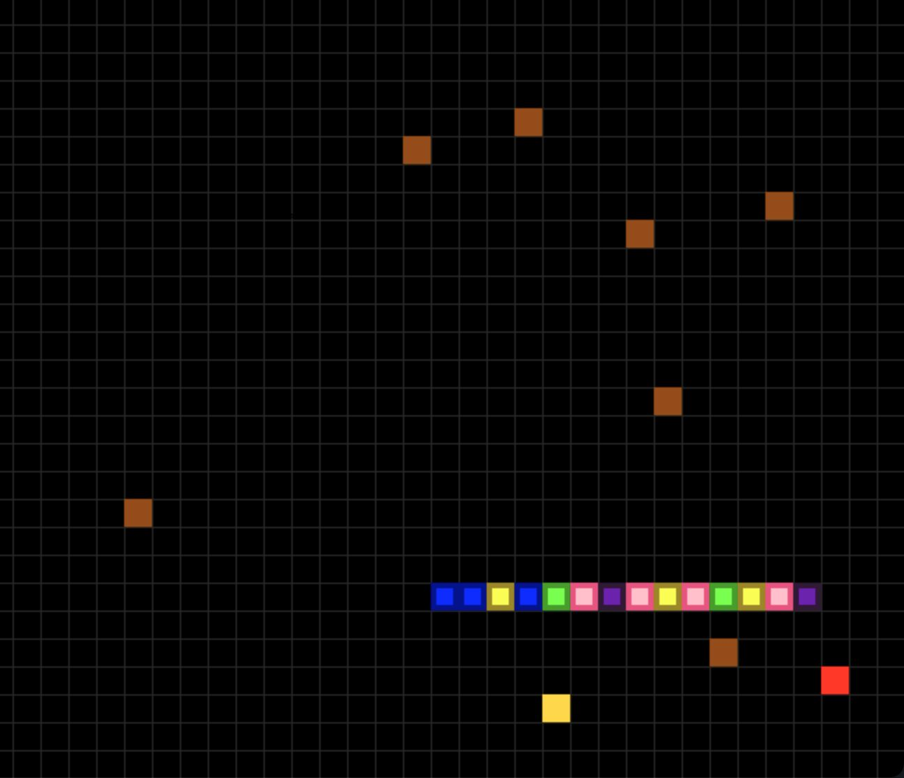

# Snake Game (Pygame)

## Overview
This project is a modern implementation of the classic Snake game using Python and Pygame.  
What makes this version unique is the addition of **golden apples** and **persistent brown obstacles**:
- Each time a normal apple is eaten, a **brown obstacle** is left behind, increasing the difficulty.
- **Golden apples** occasionally appear and, when eaten, they **clear all obstacles**, giving the player a second chance at survival.

## Project Structure
```
Snake-Pygame-main/
│
├── assets/            # Images, sounds, or fonts used in the game
├── main.py            # Entry point of the game
└── README.md          # Project documentation
```

## Requirements
- Python 3.8+
- Pygame

Install dependencies with:
```bash
pip install -r requirements.txt
```
If a `requirements.txt` is not provided, install Pygame manually:
```bash
pip install pygame
```

## Usage
1. Clone this repository:
   ```bash
   git clone https://github.com/yourusername/Snake-Pygame-main.git
   ```
2. Navigate into the project folder:
   ```bash
   cd Snake-Pygame-main
   ```
3. Run the game:
   ```bash
   python main.py
   ```

## Controls
- **Arrow Keys** – Move the snake (Up, Down, Left, Right)
- **Esc** – Quit the game

## Features
- Classic snake gameplay with added challenge mechanics.
- **Brown obstacles** appear after each apple is eaten.
- **Golden apples** reset the board by clearing all obstacles.
- Score tracking displayed in-game.
- Game over when the snake collides with a wall, itself, or an obstacle.

## Screenshot


## License
This project is provided for educational and personal use.
